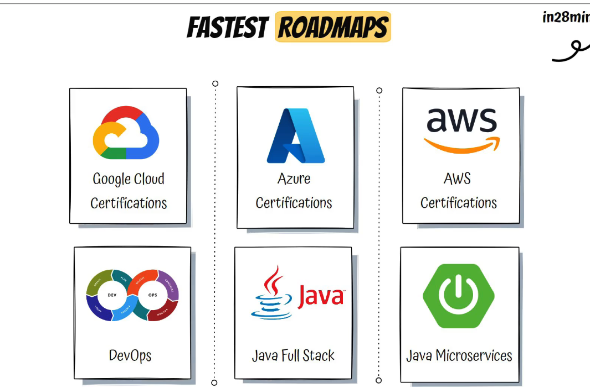

# Section-4 Quick introduction to Microservices
# 60. Intro Microservices with Spring Cloud
# 61 Step-1 Intro to microservices
# 62  Step-2 challenges with microservices
# 63 Step-3 Intro to Spring Cloud
# 64 Step-04 Advantages of microservice Architecture.
# 65 Step-05 Microservices Components  - Standardizing Ports and Url

# Section-6 : Microservices with Spring Cloud-V2
# 123 What's new in v2?
# 125 Have you already completed v1?
# 127 step-1 Setting up Limits Microservices V2
# 129 Step-2 a) Creating a hardcoded limits-service V2
# 130 Step-3 b) Enhance limits-service - Get configuration from application.props
# 134 Step-4 Setting up Spring Cloud Config Server.-v2
# 132 Step-5 Installing Git and creating a local git repository
# 134 step-6 c) Connect Spring cloud Config Server to local Git Repository -v2
# 135 step-7 Connect Limits Service to Spring Cloud Config Server.- V2
# 136 Step-8 Configuring Profiles for Limits Service
# 137  Debugging guide for microservices + Docker + docker compose
# 138 Step-9 Intro to Currency Conversion and Exchange microservices.
# 139 Step-10 Setting up Currency Exchange microservice.
# 141 Step-11 Create a simple hardcoded currency-exchange-service
# 142 Step-12 Setting up the dynamic port in the response
# 143 Step-13 Configure Jpa and Initialize Data
# 154 Step-14. Create a JPA repository - v2
# 156. Step-15 Setting up Currency Conversion Microservice -V2
# 158. Step-16 Creating a service for Currency conversion-v2
# 159. Step-17 Invoking CurrencyExchange from CurrencyConverson Microservice- v2
# 160. Step-18 using feign rest client for service invocation-v2
# 162. Step-19 Understand Naming Server and Setting up Eureka naming server-v2

