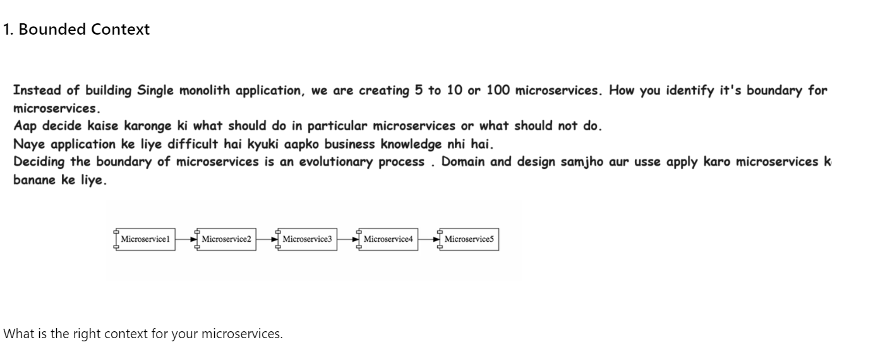
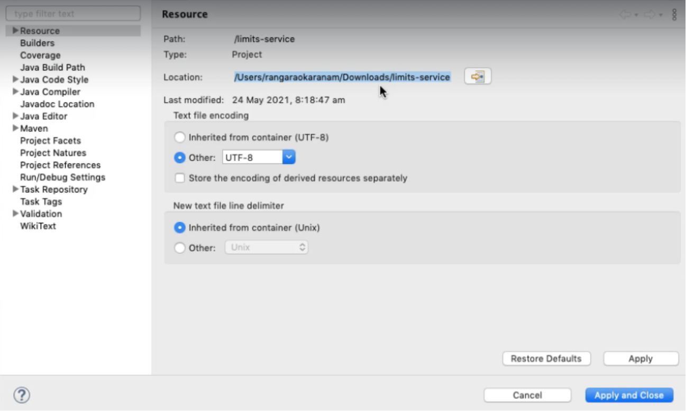
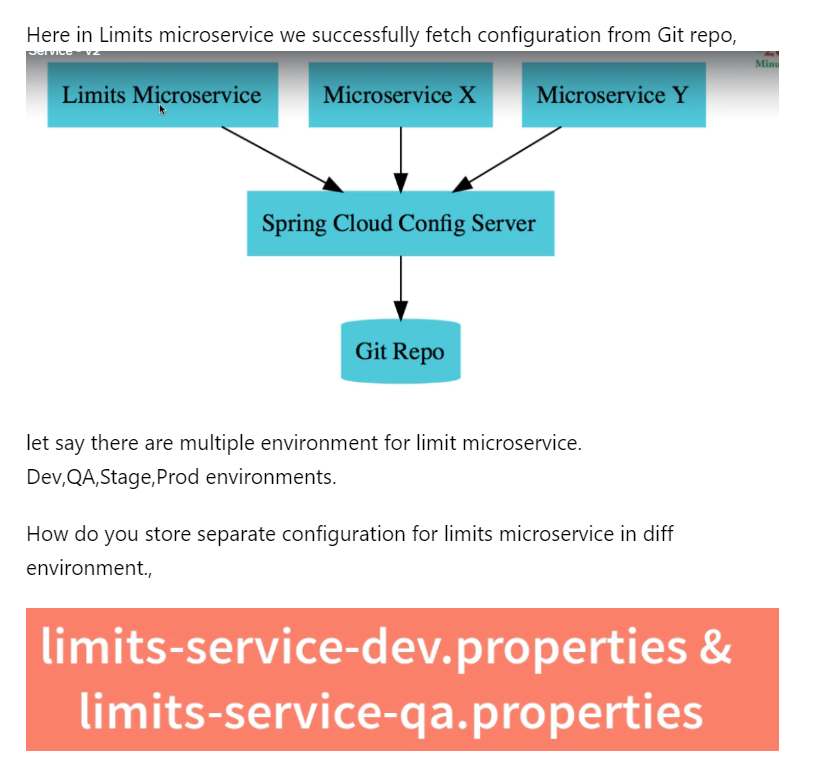
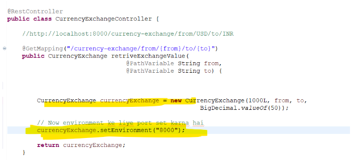

# Section-4 Quick introduction to Microservices
# 60. Intro Microservices with Spring Cloud
Why are microservices needed?  
What are the challenges associate with them?  
How does spring cloud help us to solve them.
--
# 61 Step-1 Intro to microservices
Fuzzy - Difficult to understand

### Defination


### Long Defination


### Understand microservice


1. Services which are exposed by Rest
2. Small deployable unit with very well thought out boundaries
3. this should be cloud enalbed

***Imp Keyword***
1. Rest
2. Small deployable units
3. cloud enabled

***2nd Point : Small deployable units***


***3rd point:  cloud enaled***


cloud enabled bole to kal microservice 3 par jayda load aaya to easily uke instance badha sake. 

hum easily instance add kar sake previous wale delete kar sake. without having problem This is called cloud enabled.

---
# 62  Step-2 challenges with microservices



# 63 Step-3 Intro to Spring Cloud
Distributed system mein common problem ko address karta Spring cloud.

In umbrella of Spring cloud there are multiple project which address to the problem.

Like   
1 .  Spring Cloud Config project resloved configuration problem  
2. Spring Cloud bus Project resolved communication problem.  
3 . Spring Cloud Netflix resolves problem of Eureka Server.


Spring cloud Config server provide an approach jaha aap sare configuration ek jagah git mein store kar sakte.(centralize location )

Spring cloud config server ye expose karenga microservices ko different environment ke hisab se.


### Feign
ye rest client banane ke kaam ata


# 64 Step-04 Advantages of microservice Architecture.


# 65 Step-05 Microservices Components  - Standardizing Ports and Url


# Section-6 : Microservices with Spring Cloud-V2
# 123 What's new in v2?


# 125 Have you already completed v1?


# 127 step-1 Setting up Limits Microservices V2


***Let's create a limit microservice***

hume limits-service connect karna hai to Spring Cloud Config server. Therefore here in dependency we add Config Client.


***Note: Don't have any spaces in folder path other wise microservice have problem***




# 129 Step-2 a)Creating a hardcoded limits-service V2
***Target:   
a) Create a Rest-Api which returning hardcoded data,   
 b) enhance it to pick value from configuration and  
  c) then from centralized configuration***

***a) Create a Rest-Api which returning hardcoded data***

***Limits.java***
```java
package com.adi.microservices.bean;

public class Limits {

	private int minimum;
	private int maximum;

	public Limits() {
		super();
		// TODO Auto-generated constructor stub
	}

	public Limits(int minimum, int maximum) {
		super();
		this.minimum = minimum;
		this.maximum = maximum;
	}

	public int getMinimum() {
		return minimum;
	}

	public void setMinimum(int minimum) {
		this.minimum = minimum;
	}

	public int getMaximum() {
		return maximum;
	}

	public void setMaximum(int maximum) {
		this.maximum = maximum;
	}
}
```
***LimitsController.java***
```java
package com.adi.microservices.controller;

import org.springframework.web.bind.annotation.GetMapping;
import org.springframework.web.bind.annotation.RestController;

import com.adi.microservices.bean.Limits;

@RestController
public class LimitsController {

	@GetMapping("/limits")
	public Limits retriveLimitsBean() {
		
		return new Limits(1,1000);
	}
}
```
***application.properties***
```properties

spring.config.import=optional:configserver:http://localhost:8888

```


# 130 Step-3 b) Enhance limits-service - Get configuration from application.props
 ***1. First we set the value in application.properties***  

```properties
spring.config.import=optional:configserver:http://localhost:8888

limits-service.minimum=2
limits-service.maximum=998 

```

***2.  Pick up values from application.properties file. For this Create a Configuration class and fetch everything via ConfigProperties annotation***

```java
package com.adi.microservices.configuration;

import org.springframework.boot.context.properties.ConfigurationProperties;
import org.springframework.stereotype.Component;

//Give proper name of Configuration Properties since in our application there are many.
@Component
@ConfigurationProperties("limits-service")
public class Configuration {

	private int minimum;
	private int maximum;

	public int getMinimum() {
		return minimum;
	}

	public void setMinimum(int minimum) {
		this.minimum = minimum;
	}

	public int getMaximum() {
		return maximum;
	}

	public void setMaximum(int maximum) {
		this.maximum = maximum;
	}
}
```

***3. Now controller part***
```java
package com.adi.microservices.controller;

import org.springframework.beans.factory.annotation.Autowired;
import org.springframework.web.bind.annotation.GetMapping;
import org.springframework.web.bind.annotation.RestController;

import com.adi.microservices.bean.Limits;
import com.adi.microservices.configuration.Configuration;

@RestController
public class LimitsController {
	
	@Autowired
	private Configuration configuration;

	@GetMapping("/limits")
	public Limits retriveLimitsBean() {
		
		return new Limits(configuration.getMinimum(),configuration.getMaximum());
	}
}
```


# 134 Step-4 Setting up Spring Cloud Config Server.-v2
Make sure use same version of Spring boot For config server as where config client uses.


### For config server we use port 8888

***Also give proper name to every project in     application.properties file***

```properties

spring.application.name=spring-cloud-config-server

server.port=8888

```
# 132 Step-5 Installing Git and creating a local git repository


### Go to particular folder where you want to create a git repo


## Create a proper folder


### cd to particular folder


## For present working directory use command


## Create a git repository via git init


Now here we store our centralize configuration, use proper editor for that.

Here we use Visual studio and open that folder in that.

### Here we create limits-service.properties file


### Now we commit changes
1. Go to cmd and type dir or ls


2. Now first add them commit via proper commands

for comments (git commit -m "comments")


# 134 step-6 c) Connect Spring cloud Config Server to local Git Repository -v2

### Connect github repository with config server

```properties

spring.application.name=spring-cloud-config-server

server.port=8888

spring.cloud.config.server.git.uri=file:///C:/smart_study/microservices_Ranga/git/git-localconfig-repository
```


### Enable Config server
```java
package com.adi.microservices;

import org.springframework.boot.SpringApplication;
import org.springframework.boot.autoconfigure.SpringBootApplication;
import org.springframework.cloud.config.server.EnableConfigServer;

@EnableConfigServer
@SpringBootApplication
public class SpringCloudConfigServerApplication {

	public static void main(String[] args) {
		SpringApplication.run(SpringCloudConfigServerApplication.class, args);
	}

}

```


# 135 step-7 Connect Limits Service to Spring Cloud Config Server.- V2

## Connect config client to config server


## So value configure in git hub


# 136 Step-8 Configuring Profiles for Limits Service


We do copy pasting in particular folder 


## How do you call this?


## Now how to configure dev profiles for limits microservice.
```properties

spring.config.import=optional:configserver:http://localhost:8888

spring.application.name=limits-service

limits-service.minimum=2
limits-service.maximum=998


#configure dev profile
spring.profiles.active=dev
spring.cloud.config.profile=dev
```


### Similarly for qa environment
```properties

spring.config.import=optional:configserver:http://localhost:8888

spring.application.name=limits-service

limits-service.minimum=2
limits-service.maximum=998


#configure qa profile
spring.profiles.active=qa
spring.cloud.config.profile=qa
```


# 137  Debugging guide for microservices + Docker + docker compose

https://github.com/in28minutes/spring-microservices-v3/blob/main/03.microservices/01-step-by-step-changes/readme.md#spring-cloud-config-server---steps-01-to-08

# 138 Step-9 Intro to Currency Conversion and Exchange microservices.

Currency Conversion microservice interanally call karengi currency exchange service ko aur puchengi ki aaj ka rate kya hai.. and calculate karke result devengi.


# 139 Step-10 Setting up Currency Exchange microservice.


## application.properties
```properties
spring.config.import=optional:configserver:htttp//localhost:8888
server.port=8000

spring.application.name=currency-exchange
```

# 141 Step-11 Create a simple hardcoded currency-exchange-service

Let's create a rest api for independent microservice i.e CurrencyExchangeService.  
It must have some response.


Uri for currency-exchange-service  
http://localhost:8000/currency-exchange/from/USD/to/INR

```java
package com.adi.microservicese.bean;
/*
 * Response Structure
{
   "id":10001,
   "from":"USD",
   "to":"INR",
   "conversionMultiple":65.00,
   "environment":"8000 instance-id"
}
 * */

import java.math.BigDecimal;

public class CurrencyExchange {

	private Long id;
	private String from;
	private String to;
	private BigDecimal conversionMultiple;
	public CurrencyExchange() {
		super();
		// TODO Auto-generated constructor stub
	}
	public CurrencyExchange(Long id, String from, String to, BigDecimal conversionMultiple) {
		super();
		this.id = id;
		this.from = from;
		this.to = to;
		this.conversionMultiple = conversionMultiple;
	}
	public Long getId() {
		return id;
	}
	public void setId(Long id) {
		this.id = id;
	}
	public String getFrom() {
		return from;
	}
	public void setFrom(String from) {
		this.from = from;
	}
	public String getTo() {
		return to;
	}
	public void setTo(String to) {
		this.to = to;
	}
	public BigDecimal getConversionMultiple() {
		return conversionMultiple;
	}
	public void setConversionMultiple(BigDecimal conversionMultiple) {
		this.conversionMultiple = conversionMultiple;
	}
}
```

```java
package com.adi.microservicese.controller;

import java.math.BigDecimal;

import org.springframework.web.bind.annotation.GetMapping;
import org.springframework.web.bind.annotation.PathVariable;
import org.springframework.web.bind.annotation.RestController;

import com.adi.microservicese.bean.CurrencyExchange;

@RestController
public class CurrencyExchangeController {

	//http://localhost:8000/currency-exchange/from/USD/to/INR
	
	@GetMapping("/currency-exchange/from/{from}/to/{to}")
	public CurrencyExchange retriveExchangeValue(
								@PathVariable String from,
								@PathVariable String to	) {
		
		
		return new CurrencyExchange(1000L, from, to, BigDecimal.valueOf(50));
				
	}
}

```


# 142 Step-12 Setting up the dynamic port in the response


currency conversion microservice ko pata kaise chalenga ki currency exchnge ka konsa instance response provide kar raha hai.

Different port par instance honge.

### 1. Add environment to identify the port also getter and setter


### 2.Extract local variable and set port of environment.




ye static port set hua.. hum Dynamic port set kaise kare.


### 3.How would i get value of port. Spring offer Environment


### I want to launch this application on port 8001 as well i.e multiple instances


```java
package com.adi.microservicese.bean;
/*
 * Response Structure
{
   "id":10001,
   "from":"USD",
   "to":"INR",
   "conversionMultiple":65.00,
   "environment":"8000 instance-id"
}
 * */

import java.math.BigDecimal;

public class CurrencyExchange {

	private Long id;
	private String from;
	private String to;
	private BigDecimal conversionMultiple;
	private String environment;
	
	public CurrencyExchange() {
		super();
		// TODO Auto-generated constructor stub
	}
	public CurrencyExchange(Long id, String from, String to, BigDecimal conversionMultiple) {
		super();
		this.id = id;
		this.from = from;
		this.to = to;
		this.conversionMultiple = conversionMultiple;
	}
	public Long getId() {
		return id;
	}
	public void setId(Long id) {
		this.id = id;
	}
	public String getFrom() {
		return from;
	}
	public void setFrom(String from) {
		this.from = from;
	}
	public String getTo() {
		return to;
	}
	public void setTo(String to) {
		this.to = to;
	}
	public BigDecimal getConversionMultiple() {
		return conversionMultiple;
	}
	public void setConversionMultiple(BigDecimal conversionMultiple) {
		this.conversionMultiple = conversionMultiple;
	}
	public String getEnvironment() {
		return environment;
	}
	public void setEnvironment(String environment) {
		this.environment = environment;
	}
	
}

```

```java
package com.adi.microservicese.controller;

import java.math.BigDecimal;

import org.springframework.beans.factory.annotation.Autowired;
import org.springframework.core.env.Environment;
import org.springframework.web.bind.annotation.GetMapping;
import org.springframework.web.bind.annotation.PathVariable;
import org.springframework.web.bind.annotation.RestController;

import com.adi.microservicese.bean.CurrencyExchange;

@RestController
public class CurrencyExchangeController {

	//Import core Environment not cloud config
	// @Autowired it since we require object of that 
	
	@Autowired
	private Environment environment;
	
	//http://localhost:8000/currency-exchange/from/USD/to/INR	
	@GetMapping("/currency-exchange/from/{from}/to/{to}")
	public CurrencyExchange retriveExchangeValue(
								@PathVariable String from,
								@PathVariable String to	) {
		
		
		CurrencyExchange currencyExchange = new CurrencyExchange(1000L, from, to, BigDecimal.valueOf(50));
		
		String port = environment.getProperty("local.server.port");
		
		currencyExchange.setEnvironment(port);
		
		return currencyExchange;
				
	}
}

```
# 143 Step-13 Configure Jpa and Initialize Data
