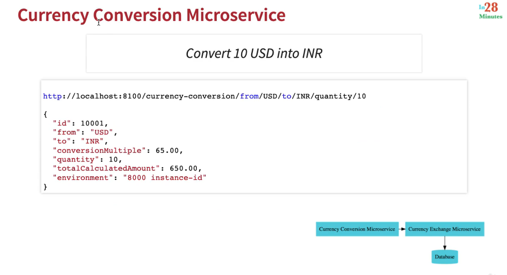
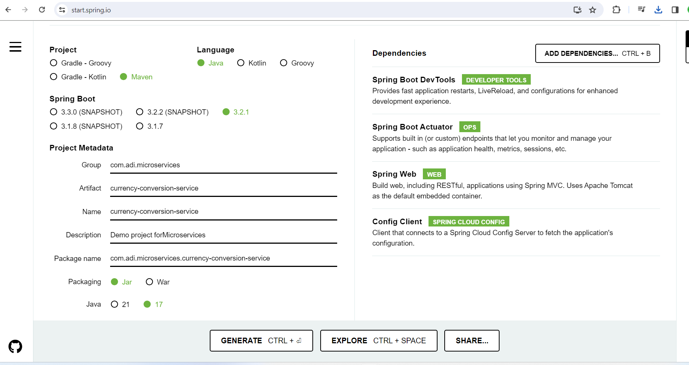
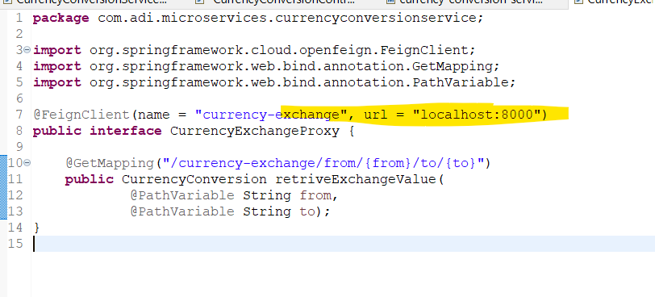
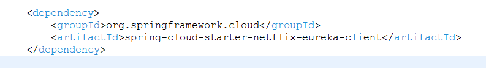
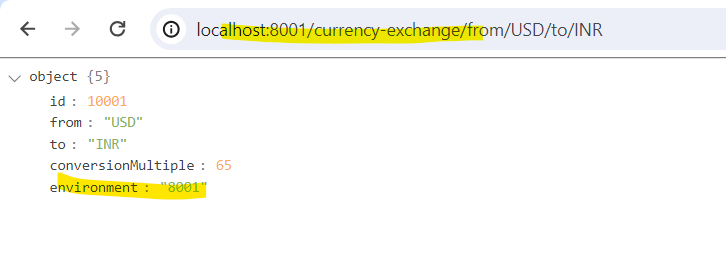
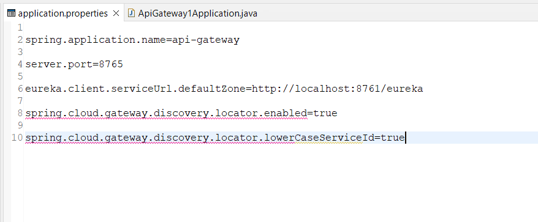

# Section-4 Quick introduction to Microservices
# 60. Intro Microservices with Spring Cloud
Why are microservices needed?  
What are the challenges associate with them?  
How does spring cloud help us to solve them.
--
# 61 Step-1 Intro to microservices
Fuzzy - Difficult to understand

### Defination


### Long Defination


### Understand microservice


1. Services which are exposed by Rest
2. Small deployable unit with very well thought out boundaries
3. this should be cloud enalbed

***Imp Keyword***
1. Rest
2. Small deployable units
3. cloud enabled

***2nd Point : Small deployable units***


***3rd point:  cloud enaled***


cloud enabled bole to kal microservice 3 par jayda load aaya to easily uke instance badha sake. 

hum easily instance add kar sake previous wale delete kar sake. without having problem This is called cloud enabled.

---
# 62  Step-2 challenges with microservices


# 63 Step-3 Intro to Spring Cloud
Distributed system mein common problem ko address karta Spring cloud.

In umbrella of Spring cloud there are multiple project which address to the problem.

Like   
1 .  Spring Cloud Config project resloved configuration problem  
2. Spring Cloud bus Project resolved communication problem.  
3 . Spring Cloud Netflix resolves problem of Eureka Server.


Spring cloud Config server provide an approach jaha aap sare configuration ek jagah git mein store kar sakte.(centralize location )

Spring cloud config server ye expose karenga microservices ko different environment ke hisab se.


### Feign
ye rest client banane ke kaam ata


# 64 Step-04 Advantages of microservice Architecture.


# 65 Step-05 Microservices Components  - Standardizing Ports and Url


# Section-6 : Microservices with Spring Cloud-V2
# 123 What's new in v2?


# 125 Have you already completed v1?


# 127 step-1 Setting up Limits Microservices V2


***Let's create a limit microservice***

hume limits-service connect karna hai to Spring Cloud Config server. Therefore here in dependency we add Config Client.


***Note: Don't have any spaces in folder path other wise microservice have problem***


# 129 Step-2 a)Creating a hardcoded limits-service V2
***Target:   
a) Create a Rest-Api which returning hardcoded data,   
 b) enhance it to pick value from configuration and  
  c) then from centralized configuration***

***a) Create a Rest-Api which returning hardcoded data***

***Limits.java***
```java
package com.adi.microservices.bean;

public class Limits {

	private int minimum;
	private int maximum;

	public Limits() {
		super();
		// TODO Auto-generated constructor stub
	}

	public Limits(int minimum, int maximum) {
		super();
		this.minimum = minimum;
		this.maximum = maximum;
	}

	public int getMinimum() {
		return minimum;
	}

	public void setMinimum(int minimum) {
		this.minimum = minimum;
	}

	public int getMaximum() {
		return maximum;
	}

	public void setMaximum(int maximum) {
		this.maximum = maximum;
	}
}
```
***LimitsController.java***
```java
package com.adi.microservices.controller;

import org.springframework.web.bind.annotation.GetMapping;
import org.springframework.web.bind.annotation.RestController;

import com.adi.microservices.bean.Limits;

@RestController
public class LimitsController {

	@GetMapping("/limits")
	public Limits retriveLimitsBean() {
		
		return new Limits(1,1000);
	}
}
```
***application.properties***
```properties

spring.config.import=optional:configserver:http://localhost:8888

```


# 130 Step-3 b) Enhance limits-service - Get configuration from application.props
 ***1. First we set the value in application.properties***  

```properties
spring.config.import=optional:configserver:http://localhost:8888

limits-service.minimum=2
limits-service.maximum=998 

```

***2.  Pick up values from application.properties file. For this Create a Configuration class and fetch everything via ConfigProperties annotation***

```java
package com.adi.microservices.configuration;

import org.springframework.boot.context.properties.ConfigurationProperties;
import org.springframework.stereotype.Component;

//Give proper name of Configuration Properties since in our application there are many.
@Component
@ConfigurationProperties("limits-service")
public class Configuration {

	private int minimum;
	private int maximum;

	public int getMinimum() {
		return minimum;
	}

	public void setMinimum(int minimum) {
		this.minimum = minimum;
	}

	public int getMaximum() {
		return maximum;
	}

	public void setMaximum(int maximum) {
		this.maximum = maximum;
	}
}
```

***3. Now controller part***
```java
package com.adi.microservices.controller;

import org.springframework.beans.factory.annotation.Autowired;
import org.springframework.web.bind.annotation.GetMapping;
import org.springframework.web.bind.annotation.RestController;

import com.adi.microservices.bean.Limits;
import com.adi.microservices.configuration.Configuration;

@RestController
public class LimitsController {
	
	@Autowired
	private Configuration configuration;

	@GetMapping("/limits")
	public Limits retriveLimitsBean() {
		
		return new Limits(configuration.getMinimum(),configuration.getMaximum());
	}
}
```


# 134 Step-4 Setting up Spring Cloud Config Server.-v2
Make sure use same version of Spring boot For config server as where config client uses.


### For config server we use port 8888

***Also give proper name to every project in     application.properties file***

```properties

spring.application.name=spring-cloud-config-server

server.port=8888

```
# 132 Step-5 Installing Git and creating a local git repository


### Go to particular folder where you want to create a git repo


## Create a proper folder


### cd to particular folder


## For present working directory use command


## Create a git repository via git init


Now here we store our centralize configuration, use proper editor for that.

Here we use Visual studio and open that folder in that.

### Here we create limits-service.properties file


### Now we commit changes
1. Go to cmd and type dir or ls


2. Now first add them commit via proper commands

for comments (git commit -m "comments")


# 134 step-6 c) Connect Spring cloud Config Server to local Git Repository -v2

### Connect github repository with config server

```properties

spring.application.name=spring-cloud-config-server

server.port=8888

spring.cloud.config.server.git.uri=file:///C:/smart_study/microservices_Ranga/git/git-localconfig-repository
```


### Enable Config server
```java
package com.adi.microservices;

import org.springframework.boot.SpringApplication;
import org.springframework.boot.autoconfigure.SpringBootApplication;
import org.springframework.cloud.config.server.EnableConfigServer;

@EnableConfigServer
@SpringBootApplication
public class SpringCloudConfigServerApplication {

	public static void main(String[] args) {
		SpringApplication.run(SpringCloudConfigServerApplication.class, args);
	}

}

```


# 135 step-7 Connect Limits Service to Spring Cloud Config Server.- V2

## Connect config client to config server


## So value configure in git hub


# 136 Step-8 Configuring Profiles for Limits Service


We do copy pasting in particular folder 


## How do you call this?


## Now how to configure dev profiles for limits microservice.
```properties

spring.config.import=optional:configserver:http://localhost:8888

spring.application.name=limits-service

limits-service.minimum=2
limits-service.maximum=998


#configure dev profile
spring.profiles.active=dev
spring.cloud.config.profile=dev
```


### Similarly for qa environment
```properties

spring.config.import=optional:configserver:http://localhost:8888

spring.application.name=limits-service

limits-service.minimum=2
limits-service.maximum=998


#configure qa profile
spring.profiles.active=qa
spring.cloud.config.profile=qa
```


# 137  Debugging guide for microservices + Docker + docker compose

https://github.com/in28minutes/spring-microservices-v3/blob/main/03.microservices/01-step-by-step-changes/readme.md#spring-cloud-config-server---steps-01-to-08

# 138 Step-9 Intro to Currency Conversion and Exchange microservices.

Currency Conversion microservice interanally call karengi currency exchange service ko aur puchengi ki aaj ka rate kya hai.. and calculate karke result devengi.


# 139 Step-10 Setting up Currency Exchange microservice.


## application.properties
```properties
spring.config.import=optional:configserver:htttp//localhost:8888
server.port=8000

spring.application.name=currency-exchange
```

# 141 Step-11 Create a simple hardcoded currency-exchange-service

Let's create a rest api for independent microservice i.e CurrencyExchangeService.  
It must have some response.


Uri for currency-exchange-service  
http://localhost:8000/currency-exchange/from/USD/to/INR

```java
package com.adi.microservicese.bean;
/*
 * Response Structure
{
   "id":10001,
   "from":"USD",
   "to":"INR",
   "conversionMultiple":65.00,
   "environment":"8000 instance-id"
}
 * */

import java.math.BigDecimal;

public class CurrencyExchange {

	private Long id;
	private String from;
	private String to;
	private BigDecimal conversionMultiple;
	public CurrencyExchange() {
		super();
		// TODO Auto-generated constructor stub
	}
	public CurrencyExchange(Long id, String from, String to, BigDecimal conversionMultiple) {
		super();
		this.id = id;
		this.from = from;
		this.to = to;
		this.conversionMultiple = conversionMultiple;
	}
	public Long getId() {
		return id;
	}
	public void setId(Long id) {
		this.id = id;
	}
	public String getFrom() {
		return from;
	}
	public void setFrom(String from) {
		this.from = from;
	}
	public String getTo() {
		return to;
	}
	public void setTo(String to) {
		this.to = to;
	}
	public BigDecimal getConversionMultiple() {
		return conversionMultiple;
	}
	public void setConversionMultiple(BigDecimal conversionMultiple) {
		this.conversionMultiple = conversionMultiple;
	}
}
```

```java
package com.adi.microservicese.controller;

import java.math.BigDecimal;

import org.springframework.web.bind.annotation.GetMapping;
import org.springframework.web.bind.annotation.PathVariable;
import org.springframework.web.bind.annotation.RestController;

import com.adi.microservicese.bean.CurrencyExchange;

@RestController
public class CurrencyExchangeController {

	//http://localhost:8000/currency-exchange/from/USD/to/INR
	
	@GetMapping("/currency-exchange/from/{from}/to/{to}")
	public CurrencyExchange retriveExchangeValue(
								@PathVariable String from,
								@PathVariable String to	) {
		
		
		return new CurrencyExchange(1000L, from, to, BigDecimal.valueOf(50));
				
	}
}

```


# 142 Step-12 Setting up the dynamic port in the response


currency conversion microservice ko pata kaise chalenga ki currency exchnge ka konsa instance response provide kar raha hai.

Different port par instance honge.

### 1. Add environment to identify the port also getter and setter


### 2.Extract local variable and set port of environment.


ye static port set hua.. hum Dynamic port set kaise kare.


### 3.How would i get value of port. Spring offer Environment


### I want to launch this application on port 8001 as well i.e multiple instances


```java
package com.adi.microservicese.bean;
/*
 * Response Structure
{
   "id":10001,
   "from":"USD",
   "to":"INR",
   "conversionMultiple":65.00,
   "environment":"8000 instance-id"
}
 * */

import java.math.BigDecimal;

public class CurrencyExchange {

	private Long id;
	private String from;
	private String to;
	private BigDecimal conversionMultiple;
	private String environment;
	
	public CurrencyExchange() {
		super();
		// TODO Auto-generated constructor stub
	}
	public CurrencyExchange(Long id, String from, String to, BigDecimal conversionMultiple) {
		super();
		this.id = id;
		this.from = from;
		this.to = to;
		this.conversionMultiple = conversionMultiple;
	}
	public Long getId() {
		return id;
	}
	public void setId(Long id) {
		this.id = id;
	}
	public String getFrom() {
		return from;
	}
	public void setFrom(String from) {
		this.from = from;
	}
	public String getTo() {
		return to;
	}
	public void setTo(String to) {
		this.to = to;
	}
	public BigDecimal getConversionMultiple() {
		return conversionMultiple;
	}
	public void setConversionMultiple(BigDecimal conversionMultiple) {
		this.conversionMultiple = conversionMultiple;
	}
	public String getEnvironment() {
		return environment;
	}
	public void setEnvironment(String environment) {
		this.environment = environment;
	}
	
}

```

```java
package com.adi.microservicese.controller;

import java.math.BigDecimal;

import org.springframework.beans.factory.annotation.Autowired;
import org.springframework.core.env.Environment;
import org.springframework.web.bind.annotation.GetMapping;
import org.springframework.web.bind.annotation.PathVariable;
import org.springframework.web.bind.annotation.RestController;

import com.adi.microservicese.bean.CurrencyExchange;

@RestController
public class CurrencyExchangeController {

	//Import core Environment not cloud config
	// @Autowired it since we require object of that 
	
	@Autowired
	private Environment environment;
	
	//http://localhost:8000/currency-exchange/from/USD/to/INR	
	@GetMapping("/currency-exchange/from/{from}/to/{to}")
	public CurrencyExchange retriveExchangeValue(
								@PathVariable String from,
								@PathVariable String to	) {
		
		
		CurrencyExchange currencyExchange = new CurrencyExchange(1000L, from, to, BigDecimal.valueOf(50));
		
		String port = environment.getProperty("local.server.port");
		
		currencyExchange.setEnvironment(port);
		
		return currencyExchange;
				
	}
}

```
# 143 Step-13 Configure Jpa and Initialize Data

yaha hum inMemory Database use karenge h2 and we have SpringDataJPA to talk with that db.

### 1. Add dependencies & Restart your app.


### see logs - an inmemory db is created for us at specific location.


### We won't require dynamic address everytime so i configure lot of things.


### Type in browser localhost:8000/h2-console since i run 8000 instance.


#### No tables is present in h2 console

### 2.create tables and add data in it.
Let's create and Entity


A table will be created for us in background check logs.


###  Expected identifier.. means we are using some keyword i.e from is a reserve keyword in sql so we can't use that.


Table is created but no data.

### Note : Name of table is Currency_Exchange and we create bean CurrencyExchange and look column. In java we differentiate with camel case, in sql use _(underscore). See above two dig

### 3. Insert data in it. Under resource folder create data.sql. 


The data is loaded before the tables are created in upgraded version in spring boot. So we need to defer the execution of data.sql.


```xml
<?xml version="1.0" encoding="UTF-8"?>
<project xmlns="http://maven.apache.org/POM/4.0.0" xmlns:xsi="http://www.w3.org/2001/XMLSchema-instance"
	xsi:schemaLocation="http://maven.apache.org/POM/4.0.0 https://maven.apache.org/xsd/maven-4.0.0.xsd">
	<modelVersion>4.0.0</modelVersion>
	<parent>
		<groupId>org.springframework.boot</groupId>
		<artifactId>spring-boot-starter-parent</artifactId>
		<version>3.2.1</version>
		<relativePath/> <!-- lookup parent from repository -->
	</parent>
	<groupId>com.adi.microservices</groupId>
	<artifactId>currency-exchange-service</artifactId>
	<version>0.0.1-SNAPSHOT</version>
	<name>currency-exchange-service</name>
	<description>Demo project forMicroservices</description>
	<properties>
		<java.version>17</java.version>
		<spring-cloud.version>2023.0.0</spring-cloud.version>
	</properties>
	<dependencies>
		<dependency>
			<groupId>org.springframework.boot</groupId>
			<artifactId>spring-boot-starter-actuator</artifactId>
		</dependency>
		<dependency>
			<groupId>org.springframework.boot</groupId>
			<artifactId>spring-boot-starter-web</artifactId>
		</dependency>
		<dependency>
			<groupId>org.springframework.cloud</groupId>
			<artifactId>spring-cloud-starter-config</artifactId>
		</dependency>

		<dependency>
			<groupId>org.springframework.boot</groupId>
			<artifactId>spring-boot-starter-data-jpa</artifactId>
		</dependency>
		
		<dependency>
			<groupId>com.h2database</groupId>
			<artifactId>h2</artifactId>
		</dependency>
		
		<dependency>
			<groupId>org.springframework.boot</groupId>
			<artifactId>spring-boot-devtools</artifactId>
			<scope>runtime</scope>
			<optional>true</optional>
		</dependency>
		<dependency>
			<groupId>org.springframework.boot</groupId>
			<artifactId>spring-boot-starter-test</artifactId>
			<scope>test</scope>
		</dependency>
	</dependencies>
	<dependencyManagement>
		<dependencies>
			<dependency>
				<groupId>org.springframework.cloud</groupId>
				<artifactId>spring-cloud-dependencies</artifactId>
				<version>${spring-cloud.version}</version>
				<type>pom</type>
				<scope>import</scope>
			</dependency>
		</dependencies>
	</dependencyManagement>

	<build>
		<plugins>
			<plugin>
				<groupId>org.springframework.boot</groupId>
				<artifactId>spring-boot-maven-plugin</artifactId>
			</plugin>
		</plugins>
	</build>

</project>

```
```java
package com.adi.microservicese.bean;
/*
 * Response Structure
{
   "id":10001,
   "from":"USD",
   "to":"INR",
   "conversionMultiple":65.00,
   "environment":"8000 instance-id"
}
 * */

import java.math.BigDecimal;

import jakarta.persistence.Column;
import jakarta.persistence.Entity;
import jakarta.persistence.Id;

@Entity
public class CurrencyExchange {

	@Id
	private Long id;
	
	@Column(name = "currency_from")
	private String from;
	
	@Column(name = "currency_to")
	private String to;
	
	private BigDecimal conversionMultiple;
	
	private String environment;
	
	public CurrencyExchange() {
		super();
		// TODO Auto-generated constructor stub
	}
	public CurrencyExchange(Long id, String from, String to, BigDecimal conversionMultiple) {
		super();
		this.id = id;
		this.from = from;
		this.to = to;
		this.conversionMultiple = conversionMultiple;
	}
	public Long getId() {
		return id;
	}
	public void setId(Long id) {
		this.id = id;
	}
	public String getFrom() {
		return from;
	}
	public void setFrom(String from) {
		this.from = from;
	}
	public String getTo() {
		return to;
	}
	public void setTo(String to) {
		this.to = to;
	}
	public BigDecimal getConversionMultiple() {
		return conversionMultiple;
	}
	public void setConversionMultiple(BigDecimal conversionMultiple) {
		this.conversionMultiple = conversionMultiple;
	}
	public String getEnvironment() {
		return environment;
	}
	public void setEnvironment(String environment) {
		this.environment = environment;
	}
	
}

```

```properties

spring.config.import=optional:configserver:htttp//localhost:8888
server.port=8000

spring.application.name=currency-exchange

#Want to see all sql statement
spring.jpa.show-sql=true

#Required static datasource url
spring.datasource.url=jdbc:h2:mem:testdb

#Enable h2 console
spring.h2.console.enabled=true

spring.jpa.defer-datasource-initialization=true

```

```sql
insert into currency_exchange
(id,currency_from,currency_to,conversion_multiple,environment)
values(10001,'USD','INR',65,'');

insert into currency_exchange
(id,currency_from,currency_to,conversion_multiple,environment)
values(10002,'EUR','INR',75,'');

insert into currency_exchange
(id,currency_from,currency_to,conversion_multiple,environment)
values(10003,'AUD','INR',25,'');
```

# 154 Step-14. Create a JPA repository - v2

Hum CurrencyExchange se hardocoded data return kar rahe hai. Ab waise na karte hue hum data db se return karenge. So hume db se operation karne ke liye interface banana honga joh JPARepostory ko extend karenga

 

 

 
 
 
 

 ```java
 package com.adi.microservicese.repo;

import org.springframework.data.jpa.repository.JpaRepository;

import com.adi.microservicese.bean.CurrencyExchange;

//Require 2 things which Entity to manage and it's primary key
public interface CurrencyExchangeRepository extends JpaRepository<CurrencyExchange, Long>{

	
	//We want to search the table kaha se kaha tak (from se to tak)
	// use findBy
	//   konsa column name from
	//      konse column tak to
	//  Dono parameter provide karne honge.. kyuki from aur to change hote rahenga
	//      Ye return kya karenga specific CurrencyExchange value
	// automatically  Spring data Jpa sql query banake fire kar lenga..
	
	CurrencyExchange findByFromAndTo(String from,String to);
	
}

 ```

```java
package com.adi.microservicese.controller;

import java.math.BigDecimal;

import org.springframework.beans.factory.annotation.Autowired;
import org.springframework.core.env.Environment;
import org.springframework.web.bind.annotation.GetMapping;
import org.springframework.web.bind.annotation.PathVariable;
import org.springframework.web.bind.annotation.RestController;

import com.adi.microservicese.bean.CurrencyExchange;
import com.adi.microservicese.repo.CurrencyExchangeRepository;

@RestController
public class CurrencyExchangeController {
	
	//Use it in Controller to fetch the data
	@Autowired
	private CurrencyExchangeRepository repository;

	//Import core Environment not cloud config
	// @Autowired it since we require object of that 
	
	@Autowired
	private Environment environment;
	
	//http://localhost:8000/currency-exchange/from/USD/to/INR	
	@GetMapping("/currency-exchange/from/{from}/to/{to}")
	public CurrencyExchange retriveExchangeValue(
								@PathVariable String from,
								@PathVariable String to	) {
		
		
//		CurrencyExchange currencyExchange = new CurrencyExchange(1000L, from, to, BigDecimal.valueOf(50));
		
		CurrencyExchange currencyExchange = repository.findByFromAndTo(from, to);
		
		if(currencyExchange == null) {
			throw new RuntimeException("Unable to find data = from : " + from +" and to : "+to);
		}
		String port = environment.getProperty("local.server.port");
		
		currencyExchange.setEnvironment(port);
		
		return currencyExchange;
				
	}
}

```

# 156. Step-15 Setting up Currency Conversion Microservice -V2


CurrencyConversion microservice is talking with in memory db.And we are creating a simple rest Api


Now we want to create a CurrencyConversion microservice





# 158. Step-16 Creating a service for Currency conversion-v2


```java
package com.adi.microservices.currencyconversionservice;

import java.math.BigDecimal;

/*
 * Response Structure
{
  "id": 10001,
  "from": "USD",
  "to": "INR",
  "quantity": 10,  //We take all input from our user
  "conversionMultiple": 65.00,  
  "totalCalculatedAmount": 650.00,
  "environment": "8000 instance-id"
}

 * */
public class CurrencyConversion {

	private Long id;
	private String from;
	private String to;
	private BigDecimal quantity;
	private BigDecimal conversionMultiple;
	private BigDecimal totalCalculatedAmount;
	private String environment;
	
	public CurrencyConversion() {
		super();
		// TODO Auto-generated constructor stub
	}
	
	public CurrencyConversion(Long id, String from, String to, BigDecimal quantity, BigDecimal conversionMultiple,
			BigDecimal totalCalculatedAmount, String environment) {
		super();
		this.id = id;
		this.from = from;
		this.to = to;
		this.quantity = quantity;
		this.conversionMultiple = conversionMultiple;
		this.totalCalculatedAmount = totalCalculatedAmount;
		this.environment = environment;
	}

	public Long getId() {
		return id;
	}

	public void setId(Long id) {
		this.id = id;
	}

	public String getFrom() {
		return from;
	}

	public void setFrom(String from) {
		this.from = from;
	}

	public String getTo() {
		return to;
	}

	public void setTo(String to) {
		this.to = to;
	}

	public BigDecimal getQuantity() {
		return quantity;
	}

	public void setQuantity(BigDecimal quantity) {
		this.quantity = quantity;
	}

	public BigDecimal getConversionMultiple() {
		return conversionMultiple;
	}

	public void setConversionMultiple(BigDecimal conversionMultiple) {
		this.conversionMultiple = conversionMultiple;
	}

	public BigDecimal getTotalCalculatedAmount() {
		return totalCalculatedAmount;
	}

	public void setTotalCalculatedAmount(BigDecimal totalCalculatedAmount) {
		this.totalCalculatedAmount = totalCalculatedAmount;
	}

	public String getEnvironment() {
		return environment;
	}

	public void setEnvironment(String environment) {
		this.environment = environment;
	}
	
	
}

```

```java
package com.adi.microservices.currencyconversionservice;

import java.math.BigDecimal;

import org.springframework.web.bind.annotation.GetMapping;
import org.springframework.web.bind.annotation.PathVariable;
import org.springframework.web.bind.annotation.RestController;

@RestController
public class CurrencyConversionController {

	//http://localhost:8100/currency-conversion/from/USD/to/INR/quantity/10
	
	@GetMapping("/currency-conversion/from/{from}/to/{to}/quantity/{quantity}")
	public CurrencyConversion calculateCurrencyConversion(
			@PathVariable String from,
			@PathVariable String to,
			@PathVariable BigDecimal quantity) {
		
		//return hardcode value
		return new CurrencyConversion(10001L, from, to, quantity, BigDecimal.ONE, BigDecimal.ONE, "");
		
	}
}

```

```properties

spring.config.import=optional:configserver:http://localhost:8888

spring.application.name=currency-conversion
server.port=8100

```


# 159. Step-17 Invoking CurrencyExchange from CurrencyConverson Microservice- v2

ek microservice dusere ko kaise call karti. Old way.

```java
package com.adi.microservices.currencyconversionservice;

import java.math.BigDecimal;
import java.util.HashMap;

import org.springframework.http.ResponseEntity;
import org.springframework.web.bind.annotation.GetMapping;
import org.springframework.web.bind.annotation.PathVariable;
import org.springframework.web.bind.annotation.RestController;
import org.springframework.web.client.RestTemplate;

@RestController
public class CurrencyConversionController {

	//http://localhost:8100/currency-conversion/from/USD/to/INR/quantity/10
	
	@GetMapping("/currency-conversion/from/{from}/to/{to}/quantity/{quantity}")
	public CurrencyConversion calculateCurrencyConversion(
			@PathVariable String from,
			@PathVariable String to,
			@PathVariable BigDecimal quantity) {
		
		//RestTemplate is used to make rest api call
		
		// U send a getRequest and you want to get object back therefore getForEntity()		
		//   1st arg - what is the url we want to invoke (currency-exchange service url)
		//      http://localhost:8000/currency-exchange/from/USD/to/INR 
		//         make sure it is running 
		//       abhi ke liye ye url hardcode karte .later on we make it dynamic. 
		//  http://localhost:8000/currency-exchange/from/{from}/to/{to} 
		//     isko hardcode nhi karna 				
		
		//   2nd arg- Response should be converted into
		//      CurrencyConversion.class
		
		//  3rd arg -next thing you pass should be what the values of from and to
		//    uriVariables ie. HashMap
		
		HashMap<String,String> uriVariables = new HashMap<>();
		uriVariables.put("from", from);
		uriVariables.put("to", to);
		
		ResponseEntity<CurrencyConversion> responseEntity = 
				new RestTemplate()
					.getForEntity("http://localhost:8000/currency-exchange/from/{from}/to/{to} ",
				    CurrencyConversion.class,
				    uriVariables);
		
		//Remember most of the fields are same in case of CurrencyExchange & CurrecnyConversion
		
		//how do you get return value from responseEntity
		CurrencyConversion currencyConversion = responseEntity.getBody();
		
		return new CurrencyConversion(
				currencyConversion.getId(),
				from, to, quantity, 
				currencyConversion.getConversionMultiple(),
				quantity.multiply(currencyConversion.getConversionMultiple()),
				currencyConversion.getEnvironment());
		
	}
}

```


# 160. Step-18 using feign rest client for service invocation-v2

A simple microservice ko call karne ke liye aapko upar ke program mein 20 lines of code likhna pad raha hai. Image yadi 100 microservice ko ek mek ko call karna hia  to.. Therefore to make easy call feign comes in picture.

### Step-1 Add depedency


### Step-2 Enable Feign Client - jaha se apne ko call karna hia proxy ko


hume currencyconversionService se currency-exchange ko call karna hai... So create an interface proxy for that.

### Step-3 Create a proxy 
#### a) Give proper name in proxy. Name aisa do jisko call karna hia uska application name hona mangata.


This should match with this


#### b) we need to put url -


#### c) jo specific service  call karna hai it should part of method


isse call karna hia apne proxy mein.. aisa likhna hia ki ye return kare.. CurrencyConversion


Yaha automatically map ho javengi value..

Now proxy is ready.

### Step-4 Use proxy to call microservices


```xml
<?xml version="1.0" encoding="UTF-8"?>
<project xmlns="http://maven.apache.org/POM/4.0.0" xmlns:xsi="http://www.w3.org/2001/XMLSchema-instance"
	xsi:schemaLocation="http://maven.apache.org/POM/4.0.0 https://maven.apache.org/xsd/maven-4.0.0.xsd">
	<modelVersion>4.0.0</modelVersion>
	<parent>
		<groupId>org.springframework.boot</groupId>
		<artifactId>spring-boot-starter-parent</artifactId>
		<version>3.2.1</version>
		<relativePath/> <!-- lookup parent from repository -->
	</parent>
	<groupId>com.adi.microservices</groupId>
	<artifactId>currency-conversion-service</artifactId>
	<version>0.0.1-SNAPSHOT</version>
	<name>currency-conversion-service</name>
	<description>Demo project forMicroservices</description>
	<properties>
		<java.version>17</java.version>
		<spring-cloud.version>2023.0.0</spring-cloud.version>
	</properties>
	<dependencies>
		<dependency>
			<groupId>org.springframework.boot</groupId>
			<artifactId>spring-boot-starter-actuator</artifactId>
		</dependency>
		<dependency>
			<groupId>org.springframework.boot</groupId>
			<artifactId>spring-boot-starter-web</artifactId>
		</dependency>
		<dependency>
			<groupId>org.springframework.cloud</groupId>
			<artifactId>spring-cloud-starter-config</artifactId>
		</dependency>
		
		<dependency>
			<groupId>org.springframework.cloud</groupId>
			<artifactId>spring-cloud-starter-openfeign</artifactId>
		</dependency>

		<dependency>
			<groupId>org.springframework.boot</groupId>
			<artifactId>spring-boot-devtools</artifactId>
			<scope>runtime</scope>
			<optional>true</optional>
		</dependency>
		<dependency>
			<groupId>org.springframework.boot</groupId>
			<artifactId>spring-boot-starter-test</artifactId>
			<scope>test</scope>
		</dependency>
	</dependencies>
	<dependencyManagement>
		<dependencies>
			<dependency>
				<groupId>org.springframework.cloud</groupId>
				<artifactId>spring-cloud-dependencies</artifactId>
				<version>${spring-cloud.version}</version>
				<type>pom</type>
				<scope>import</scope>
			</dependency>
		</dependencies>
	</dependencyManagement>

	<build>
		<plugins>
			<plugin>
				<groupId>org.springframework.boot</groupId>
				<artifactId>spring-boot-maven-plugin</artifactId>
			</plugin>
		</plugins>
	</build>

</project>

```
```java
package com.adi.microservices.currencyconversionservice;

import org.springframework.boot.SpringApplication;
import org.springframework.boot.autoconfigure.SpringBootApplication;
import org.springframework.cloud.openfeign.EnableFeignClients;

@SpringBootApplication
@EnableFeignClients
public class CurrencyConversionServiceApplication {

	public static void main(String[] args) {
		SpringApplication.run(CurrencyConversionServiceApplication.class, args);
	}

}

```
```java
package com.adi.microservices.currencyconversionservice;

import org.springframework.cloud.openfeign.FeignClient;
import org.springframework.web.bind.annotation.GetMapping;
import org.springframework.web.bind.annotation.PathVariable;

@FeignClient(name = "currency-exchange", url = "localhost:8000")
public interface CurrencyExchangeProxy {

	@GetMapping("/currency-exchange/from/{from}/to/{to}")
	public CurrencyConversion retriveExchangeValue(
			@PathVariable String from,
			@PathVariable String to);
}

```
```java
package com.adi.microservices.currencyconversionservice;

import java.math.BigDecimal;
import java.util.HashMap;

import org.springframework.beans.factory.annotation.Autowired;
import org.springframework.http.ResponseEntity;
import org.springframework.web.bind.annotation.GetMapping;
import org.springframework.web.bind.annotation.PathVariable;
import org.springframework.web.bind.annotation.RestController;
import org.springframework.web.client.RestTemplate;

@RestController
public class CurrencyConversionController {

	@Autowired
	private CurrencyExchangeProxy proxy;

	@GetMapping("/currency-conversion-feign/from/{from}/to/{to}/quantity/{quantity}")
	public CurrencyConversion calculateCurrencyConversionFeign(
			@PathVariable String from, 
			@PathVariable String to,
			@PathVariable BigDecimal quantity) {

		CurrencyConversion currencyConversion = proxy.retriveExchangeValue(from, to);

		return new CurrencyConversion(currencyConversion.getId(), from, to, quantity,
				currencyConversion.getConversionMultiple(),
				quantity.multiply(currencyConversion.getConversionMultiple()),
				currencyConversion.getEnvironment() + "  Feign");

	}

	// http://localhost:8100/currency-conversion/from/USD/to/INR/quantity/10
	@GetMapping("/currency-conversion/from/{from}/to/{to}/quantity/{quantity}")
	public CurrencyConversion calculateCurrencyConversion(
			@PathVariable String from,
			@PathVariable String to,
			@PathVariable BigDecimal quantity) {

		HashMap<String, String> uriVariables = new HashMap<>();
		uriVariables.put("from", from);
		uriVariables.put("to", to);

		ResponseEntity<CurrencyConversion> responseEntity = 
						new RestTemplate().getForEntity(
				"http://localhost:8000/currency-exchange/from/{from}/to/{to} ", 
				CurrencyConversion.class, 
				uriVariables);

		CurrencyConversion currencyConversion = responseEntity.getBody();

		return new CurrencyConversion(currencyConversion.getId(), from, to, quantity,
				currencyConversion.getConversionMultiple(),
				quantity.multiply(currencyConversion.getConversionMultiple()),
				currencyConversion.getEnvironment() + " Rest Template");

	}

}

```
# 162. Step-19 Understand Naming Server and Setting up Eureka naming server-v2

Upar pgm mein microservice ek dusre ko badhiya call kar rahi hai.. but abhi bhi thoda problem hai.

### a) we are hardcoding the url in currency-exchange-proxy


Abhi currency-conversion ye currency exchange ke 8000 instance se talk kar raha hia.. Kal hume (i.e currency-conversion ko) yadi dusre instance (i.e currency-exchange 8001) se talk karna raha so we need to again hardcoded the url


This is not the good solution.


### WE need to dynamically launch the currency-exchange instances and distributed load between them.


### For this purpose we go for service registry or naming server.

### 1. All the instances of all the microservices should be register with service registry.


Ab yadi currency Conversion ko talk karna hai currency-exchange se so wo naming server ko puchenga.. ki what are the instance are available for currency-exchange aur jo instance up honga .. usse baat kar lenga.


iss tarah se aasani se load balance ho javenga.

## Let's create naming server


### Step-1 Add dependency 
You already did at the time of creation of project

### Step-2 Enable Eureka server


### Step-3 configuring ports and all stuffs


# 163. Debugging problem with Eureka
https://github.com/in28minutes/spring-microservices-v3/blob/main/03.microservices/01-step-by-step-changes/readme.md#eureka---step-19-to-21


# 164 Step-20. Connect CurrencyConversion and CurrencyExchange microservice

## Let's connect our microservices to naming server.

### Step-1 Add dependency

This dependency added in pom.xml of CurrencyExchange and CurrencyConversion microservices


if some error come add this line in app.properties since there is some check happen


### Step-2 Configure naming server url in app.prop
WE want to play really safe. so directly add url in app.properties


When you add this this microservice will reregisterd itself with Eureka server.

Ho sakta hai aage hume aur different eureka server se connect hona pade. Par default url ye hai.


### Read naming server logs


Application jab register hoti hai tab status up hota hai and unregisterd jab hoti hai tab status down hota hai

Jab bhi aap application restart karte ho.. tab application pahele unregister hoti hai phir register hoti hai.

### currency-exchange
```properties

spring.config.import=optional:configserver:htttp//localhost:8888
server.port=8000

spring.application.name=currency-exchange

#Want to see all sql statement
spring.jpa.show-sql=true

#Required static datasource url
spring.datasource.url=jdbc:h2:mem:testdb

#Enable h2 console
spring.h2.console.enabled=true

spring.jpa.defer-datasource-initialization=true


eureka.client.serviceUrl.defaultZone=http://localhost:8761/eureka

```

### currency-conversion app.prop
```properties

spring.config.import=optional:configserver:http://localhost:8888

spring.application.name=currency-conversion
server.port=8100


spring.cloud.config.import-check.enabled=false

eureka.client.serviceUrl.defaultZone=http://localhost:8761/eureka
```

### dependency
```xml
	<dependency>
			<groupId>org.springframework.cloud</groupId>
			<artifactId>spring-cloud-starter-netflix-eureka-client</artifactId>
		</dependency>
```

# 166 Git hub repo updates
Use the following repo's based on your Spring Boot version

Spring Boot 3.0+ - https://github.com/in28minutes/spring-microservices-v3

Spring Boot 2.4+ - https://github.com/in28minutes/spring-microservices-v2

# 167 Step-21 quickstart by importing microservices


If you have problem with import make sure you use latest version of ecilipse.

# 168 Step-22 Load balancing with eureka, feign and spring cloud loadbalancer.

### Loadbalancing between multiple instances of currency-exchange microservices.


### To make a loadbalance between multiple instances, Go to proxy and do the following changes.


### Now let's launch multiple instances of currency-exchange and observe currency-conversion



In eureka- 2 instances are running for currency-exchange instance.


Currency-conversion


#### What happen?
Inside currency-conversion microservice there is a compoonent called load balancer which is talking to the naming server, finding the instances and automatically doing the load balance between them.  
This is called Client side load balancing.  
And this is happening through feign. 


#### How does feign do load balancing?
Go to currencncy conversion microservice pom.xml


There is load balancer brought by netflix eureka client to the classpath. And this loadbalancer is used by feign to actually distribute the load between multiple instances which are return by Eureka.

Now Spring cloud load balancer is used earlier there is Ribbion.

# 169. Step-22 Setting up a Spring cloud Api gateway.

All microservices have lot's of common feature authentication, autherization, logging, rate limiting etc.. 

so where you implement these common feture. The solution is API Gateway. 

Earlier there is Zull who is responsible for doing that but no longer support by eureka. 

Now Spring Cloud Gateway is responsible to handle all stuff.


### Note: Not working
Earlier we select this 


In pom.xml it is identified that


So now we take


having dependency


In app.propertis


### Always check dependency otherwise project not work, also i take help of maven dependencies.


# 171. Step-23 Enabling discovery locator with Eureka for spring cloud gateway.


The port we launch an api-gateway

http://localhost:8765/

How currency exchange service is registered in eureka naming server.


so we want to route/call the request via api-gateway

http://localhost:8765/CURRENCY-EXCHANGE/currency-exchange/from/USD/to/INR

Before doing anything lets confirm that the currency-exchange is running fine


Actually we want api-gateway to talk with registred name and route request/traffic from there.

We required configuration in app.props.


Give your client this url and whatever common feature you require write in api-gateway. 

Eg- You require user with some authentication or authrization can access particular microservices. So you write all feature in api-gateway and give client this api-gateway url.

When a user hit.. he has to fulfill all the condition. This part taken care by api-gateway.


Initial

- http://localhost:8765/CURRENCY-EXCHANGE/currency-exchange/from/USD/to/INR

- http://localhost:8765/CURRENCY-CONVERSION/currency-conversion/from/USD/to/INR/quantity/10

- http://localhost:8765/CURRENCY-CONVERSION/currency-conversion-feign/from/USD/to/INR/quantity/10

### Now to make below url works
Lower Case

- http://localhost:8765/currency-exchange/currency-exchange/from/USD/to/INR

- http://localhost:8765/currency-conversion/currency-conversion/from/USD/to/INR/quantity/10

- http://localhost:8765/currency-conversion/currency-conversion-feign/from/USD/to/INR/quantity/10




# 172. Debugging problem
https://github.com/in28minutes/spring-microservices-v3/blob/main/03.microservices/01-step-by-step-changes/readme.md#spring-cloud-api-gateway---step-22-to-step-25


# 173 step-24 Exploring routes via spring cloud gateway.

